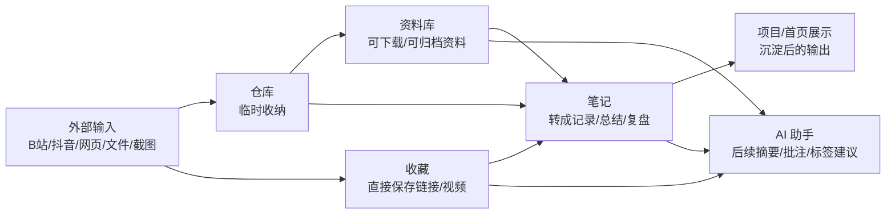
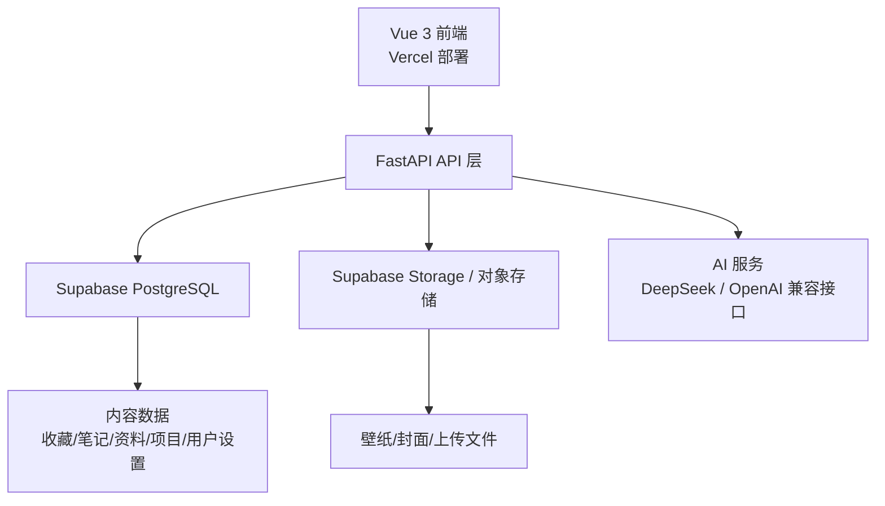

# 个人网站整体架构设计文档

更新时间：2026-07-28

## 1. 项目定位

这个网站不是单纯的个人展示页，而是一个长期维护的个人数字空间。

目标分成 3 层：

1. 展示层
   对外展示你是谁、在做什么、做过什么、在学什么。
2. 管理层
   对内管理收藏、笔记、资料、仓库、项目，形成个人内容工作流。
3. 智能层
   后续接入 AI，对内容做摘要、分类建议、批注、转写和整理。

当前建议的产品定位：

- 个人主页 + 内容中枢
- 学习资料管理站
- 视频/网页收藏夹
- 成长记录和经验沉淀系统
- 可持续迭代的个人项目

## 2. 当前现状

当前前端已经具备以下页面：

- 首页 `/`
- 收藏 `/collection`
- 笔记 `/notes`
- 资料库 `/library`
- 项目 `/projects`
- 仓库 `/vault`
- AI 助手 `/chat`

当前前端已经具备以下本地能力：

- 收藏：本地新增、编辑、删除、分类筛选
- 笔记：本地新增、编辑、删除、详情查看
- 资料库：本地新增、编辑、删除、卡片/列表视图、视频/链接/文件多展示形态
- 仓库：本地文件上传、本地链接收纳、转存到收藏/笔记/资料库
- 首页壁纸：本地 `IndexedDB` 保存

当前后端能力较弱，仅有：

- `GET /api/health`
- `POST /api/chat`

当前数据存储状态：

- 页面核心数据主要存在浏览器本地 `localStorage`
- 仓库和壁纸图片存在浏览器本地 `IndexedDB`
- 还没有统一的云数据库和正式内容 API

## 3. 闭环目标

你现在最需要的不是继续堆页面，而是把“内容进入网站之后怎么流动”做成闭环。

建议闭环如下：

闭环的核心原则：

- 仓库是中转站，不是最终归宿
- 收藏负责“先收进来”
- 笔记负责“变成自己的东西”
- 资料库负责“长期保存和复用”
- 项目负责“对外讲述成果”

## 4. 为什么优先推荐 Supabase / PostgreSQL

### 4.1 不是不能用 MySQL

MySQL 完全可以用。  
如果你以后更想走传统后端路线，也可以做成：

- `FastAPI + MySQL + SQLAlchemy + 云对象存储`

### 4.2 为什么当前阶段更推荐 Supabase / PostgreSQL

因为你现在没有云服务器，也没有现成 MySQL 服务。  
Supabase 更适合当前阶段，原因是它已经帮你做好了这些：

- 托管 PostgreSQL 数据库
- Web 管理后台
- 文件存储
- 用户认证
- API 能力
- 行级权限控制

这意味着：

- 你不需要自己买服务器装数据库
- 你不需要先装 Navicat / MySQL Server / Nginx / Docker 才能开始
- 你可以先把网站功能跑通，再决定后续是否迁移到自建后端

### 4.3 你需要安装什么软件

如果走 Supabase：

- 本地开发不强制安装数据库软件
- 可选安装：
  - Node.js
  - Python
  - Supabase CLI（后期需要时再装）

如果走 MySQL：

- 你需要准备 MySQL 服务
- 本地通常要装：
  - MySQL Server
  - 可视化工具，如 Navicat / DBeaver

### 4.4 当前建议

当前阶段先采用：

- 前端继续本地数据结构演进
- 后端接口先设计好
- 云数据目标默认按 `Supabase/PostgreSQL` 规划

后续如果你坚持 MySQL，再做数据库层替换即可。

## 5. 目标系统架构

建议的最终系统如下：

### 5.1 前端

- 技术：`Vue 3 + Vite + Vue Router`
- 作用：
  - 页面展示
  - 表单交互
  - 内容管理
  - 调用后端 API

### 5.2 后端

- 技术：`FastAPI`
- 作用：
  - 统一数据 API
  - AI 接口代理
  - 文件上传管理
  - 后续认证和权限

### 5.3 数据库

- 当前推荐：`PostgreSQL`
- 托管方式：`Supabase`
- 作用：
  - 结构化保存内容数据
  - 支持后续筛选、搜索、排序、统计

### 5.4 文件存储

建议后续把以下内容放入对象存储：

- 首页自定义壁纸
- 资料库文件
- 资料封面图
- 收藏视频缩略图
- 项目截图

## 6. 模块设计

### 6.1 首页 Home

作用：

- 展示个人定位
- 展示当前重点方向
- 展示最近更新
- 作为所有模块入口

建议模块：

- Hero 区
- 快捷入口区
- 最近整理区
- 当前建设路线区
- 后续可增加“精选内容”

### 6.2 收藏 Collection

作用：

- 存视频、网页、文章、外部资源
- 像 B 站收藏夹一样浏览

当前字段建议：

- `id`
- `title`
- `url`
- `platform`
- `category`
- `status`
- `cover`
- `tags`
- `note`
- `created_at`

后续 AI 可加字段：

- `summary`
- `highlights`
- `transcript`
- `ai_tags`

### 6.3 笔记 Notes

作用：

- 学习记录
- 经验总结
- 日记
- 复盘

字段建议：

- `id`
- `title`
- `mood`
- `excerpt`
- `content`
- `tags`
- `created_at`
- `updated_at`

### 6.4 资料库 Library

作用：

- 文件资料管理
- 网页资料管理
- 视频资料卡片展示

字段建议：

- `id`
- `title`
- `category`
- `resource_type`
  - 文件
  - 链接
  - 图片
  - 视频
- `presentation`
  - 文件下载
  - 普通链接
  - 图片卡片
  - 视频卡片
- `url`
- `file_name`
- `storage_path`
- `cover`
- `tags`
- `note`
- `status`
- `created_at`

### 6.5 仓库 Vault

作用：

- 收纳临时文件
- 收纳临时链接
- 中转到收藏/笔记/资料库

字段建议：

- `id`
- `kind`
  - file
  - link
- `title`
- `name`
- `type`
- `size`
- `url`
- `data`
- `note`
- `added_at`

### 6.6 项目 Projects

作用：

- 对外展示成果
- 讲述项目故事

字段建议：

- `id`
- `name`
- `summary`
- `detail`
- `status`
- `stack`
- `cover`
- `demo_url`
- `repo_url`
- `learnings`

### 6.7 AI 助手 Chat

作用：

- 对话
- 资料摘要
- 收藏整理
- 标签建议
- 内容转笔记

后续定位建议：

- 从“聊天页面”升级为“内容整理助手”

## 7. 推荐数据库表结构

建议未来至少有这些表：

- `collections`
- `notes`
- `library_items`
- `vault_items`
- `projects`
- `settings`

可选再加：

- `ai_jobs`
- `ai_summaries`
- `tags`
- `content_relations`

### 7.1 settings

存用户站点配置：

- 壁纸
- 首页文案
- 默认主题
- 社交链接

## 8. 推荐 API 规划

建议后端后续设计成 REST API：

### 8.1 收藏

- `GET /api/collections`
- `POST /api/collections`
- `PUT /api/collections/{id}`
- `DELETE /api/collections/{id}`

### 8.2 笔记

- `GET /api/notes`
- `POST /api/notes`
- `PUT /api/notes/{id}`
- `DELETE /api/notes/{id}`

### 8.3 资料库

- `GET /api/library`
- `POST /api/library`
- `PUT /api/library/{id}`
- `DELETE /api/library/{id}`

### 8.4 仓库

- `GET /api/vault`
- `POST /api/vault/files`
- `POST /api/vault/links`
- `DELETE /api/vault/{id}`
- `POST /api/vault/{id}/transfer`

### 8.5 设置

- `GET /api/settings`
- `PUT /api/settings`
- `POST /api/settings/wallpaper`

### 8.6 AI

- `POST /api/chat`
- `POST /api/ai/summarize-collection`
- `POST /api/ai/summarize-library`
- `POST /api/ai/turn-to-note`

## 9. 推荐实施路线

### 阶段 1：前端本地闭环

目标：

- 收藏本地可用
- 笔记本地可用
- 资料库本地可用
- 仓库可转存

当前进度：

- 已完成

### 阶段 2：统一数据模型

目标：

- 清理编码问题
- 统一字段命名
- 统一本地 store 结构
- 准备 API 契约

当前建议：

- 下一步进入

### 阶段 3：接云数据库

目标：

- 把 `localStorage/IndexedDB` 数据迁到云端
- 前端 store 改成 API 调用
- 保留本地缓存体验

推荐方案：

- `Supabase PostgreSQL`

### 阶段 4：接文件存储

目标：

- 首页壁纸上传到云
- 资料文件上传到云
- 项目截图和封面云存储

### 阶段 5：接 AI 工作流

目标：

- 视频摘要
- 网页摘要
- 自动标签
- 一键转笔记

## 10. 你现在最适合做什么

如果不急着上后端，最优顺序是：

1. 继续把前端本地闭环完善
2. 统一数据模型和 API 设计
3. 再接云数据库

原因：

- 现在页面逻辑还在快速变化
- 过早接后端，容易重复改接口
- 当前先把产品结构跑顺，后端实现成本更低

## 11. 下一步建议

下一步推荐执行内容：

1. 清理当前前端文件里的中文乱码问题
2. 补一份统一数据模型定义文件
3. 给后端加第一版资源 API 设计骨架
4. 规划 Supabase 接入方式

## 12. 最终建议结论

当前最稳方案：

- 前端：继续 Vue 3
- 后端：继续 FastAPI
- 云数据库：先按 `Supabase/PostgreSQL` 规划
- 文件存储：后续接 `Supabase Storage`
- AI：继续走兼容 OpenAI SDK 的接口

对你来说，这条路线的优点是：

- 不需要自己买服务器装数据库
- 后续部署和演示更容易
- 产品闭环清晰
- 面试时也更容易讲

